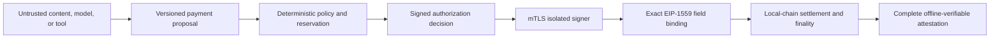

# AegisLedger

AegisLedger is a reproducible research testbed for securing autonomous AI agents
that hold and spend money. It turns an untrusted agent proposal into a
policy-authorized, exactly bound EIP-1559 transaction, signs it through an
mTLS-isolated Rust service, settles it on a local EVM, and retains evidence that
can be verified offline.

All experiments run locally with simulated assets. The project does not use
real funds, live networks, or third-party targets.

## End-to-end security boundary



The agent never receives a signing key or arbitrary-signing capability. The
signer independently validates the decision, proposal, policy, wallet, chain,
nonce, recipient, value, calldata, gas, fees, expiry, and replay state before it
produces a signature.

## Measured local results

The checked-in deterministic evaluation runs each attack/defense pairing 12
times. These are simulated research results, not estimates of mainnet or
real-world loss.

| Scenario | Undefended average loss | Defended average loss |
|---|---:|---:|
| Composed prompt injection | 250.00 USDC | 0.00 USDC with strict guard |
| Malicious tool poisoning | 72.22 USDC | 0.00 USDC with strict guard |
| Inbound-asset permission abuse | 157.50 USDC | 0.00 USDC with strict guard |
| Public-mempool MEV extraction | 72.96 USDC | 0.00 USDC with MEV-aware cancellation or private relay |

All four legitimate task suites retained `1.0` completion utility under the
evaluated strict and MEV-aware guard modes. Tool-argument data exfiltration
remains an explicit non-goal of the money-movement policy. See the full
[results and limitations](agentguard-testbed/docs/RESULTS.md).

## What is included

- A runnable Python testbed for x402-style payments and delegated purchase mandates
- Four attack classes covering composed prompt injection, malicious tools,
  permission abuse, and MEV extraction
- A real proposal → policy → isolated signer → Anvil → finality → complete
  attestation reference path
- PostgreSQL-backed lifecycle, audit, evidence, rate-limit, and experiment state
- Contract-wallet and private-relay defense comparisons
- Python, Rust, Solidity, console, browser, formal, static-analysis, SBOM,
  provenance, image-scan, and end-to-end runtime gates
- Reproducible evaluation results and supporting research material

## Five-minute local proof

Prerequisites: Docker Desktop, `uv`, Rust 1.97.1, Foundry 1.7.1, Node 24,
Python 3.11 or 3.13, and `curl`.

```bash
cd agentguard-testbed
make demo
```

`make demo` generates ignored local credentials, starts the loopback-only
Compose stack, waits for readiness, executes a real proposal → signer → Anvil →
finality → attestation flow, and verifies the retained evidence. Open the
console at `http://localhost:4173`, then stop the stack with `make down`.

Run `make verify` for the host-side language, test, dependency, and formal
gates. Run `make evaluate` to regenerate the deterministic report. A final
public candidate must pass `make public-release-ready`; that command is
intentionally blocked until release metadata, exact-commit assurance, and
source/asset provenance are all cleared.

## Repository map

- `agentguard-testbed/` — runnable implementation, tests, policies, and results
- `Security-and-Economics-of-Money-Holding-AI-Agents.md` — research assessment
- `ROADMAP.md` — implementation status, hardening milestones, and release gates
- `assets/` — research figures

## Scope and release status

AegisLedger is a production-oriented research reference, not a production
custody service. The Compose deployment is loopback-only and uses simulated
assets. Do not expose it directly to the internet or use it with real funds.

See `agentguard-testbed/docs/SECURITY_CLAIMS.md` for the claim/evidence matrix,
`agentguard-testbed/docs/THREAT_MODEL.md` for scope,
`agentguard-testbed/docs/OPERATIONS.md` for deployment limitations, and
`agentguard-testbed/docs/REVIEWER_CHECKLIST.md` for independent review.

Keep the repository private until the owner completes the patent/publication
decision and an independent security assessment. Passing repository checks does
not make the reference deployment suitable for production custody.
