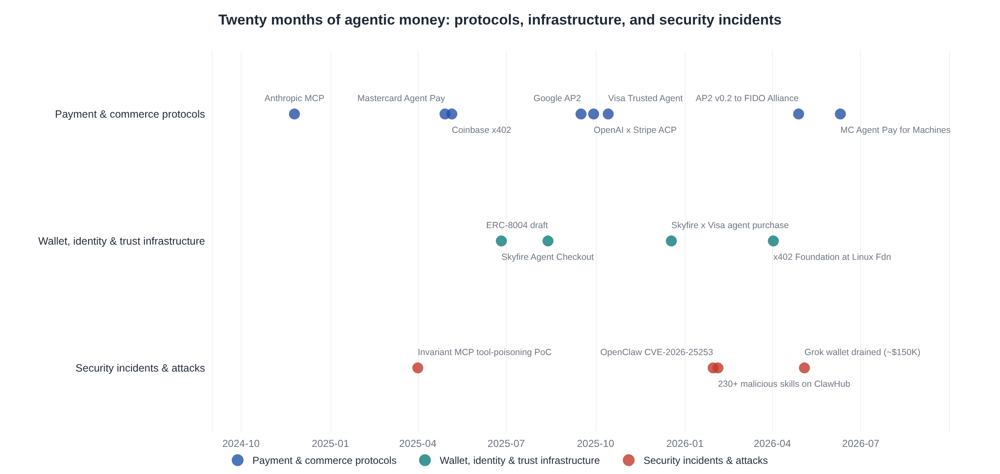
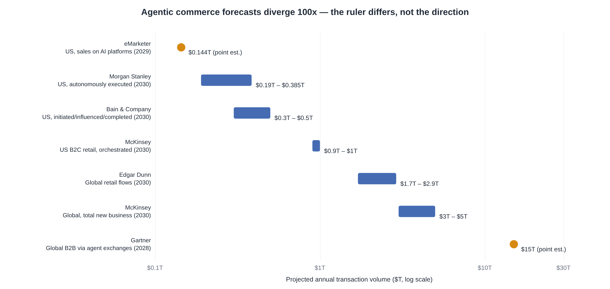
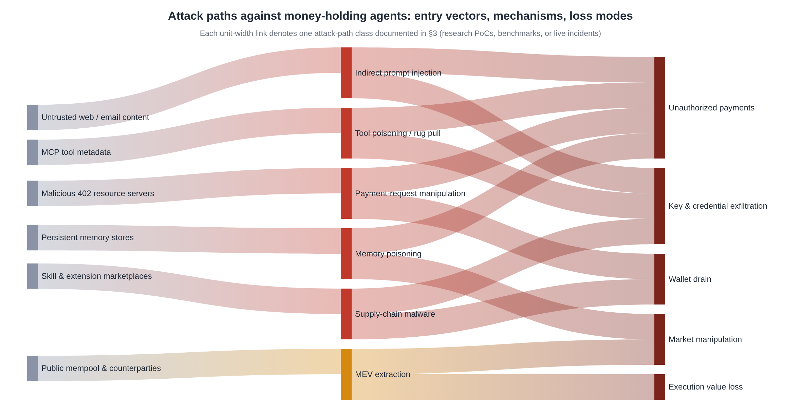
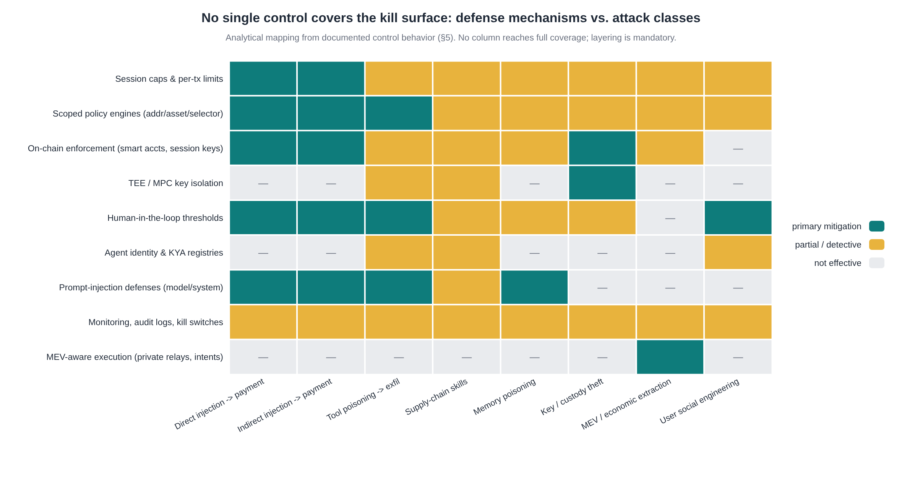
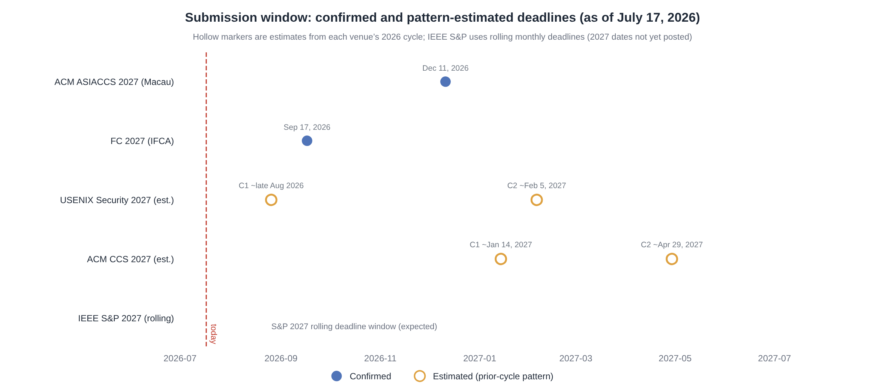

# When Agents Hold Money: Security and Economics of Autonomous AI Payment Agents

**A deep-research assessment of the deployment landscape, demonstrated attacks, existing defenses, and the research gap — written to validate and sharpen a proposed research program on spending-policy enforcement, authorization delegation, and MEV exposure for wallet-holding LLM agents.**

*Prepared July 17, 2026. All market figures, incidents, and protocol details are drawn from the sources cited inline; academic claims are anchored to the peer-reviewed and preprint literature surveyed.*

---

## Executive Summary

The core premise of the proposed project — that **deployment of money-holding AI agents is running ahead of the security science** — is confirmed by this investigation, with an important sharpening: the gap is real but it is **closing from two directions at once**, and the window for a clean "first" is probably 12–24 months. Between May 2025 and June 2026, Coinbase's x402, Google's AP2, OpenAI/Stripe's ACP, Visa's Trusted Agent Protocol, Mastercard's Agent Pay and Agent Pay for Machines, and the ERC-8004 trustless-agents standard created a full production stack for agent-held funds, and x402 alone processed **75.41 million transactions worth $24.24 million in the last 30 days** across 94,000 buyers and 22,000 sellers [^13^]. In parallel, the security community has already produced the first wave of money-relevant evidence: the MCPTox benchmark measured an average **36.5% tool-poisoning attack success rate across 20 frontier models** (peaking at 72.8%) [^42^][^35^]. On May 4, 2026, an attacker used a Morse-coded post on X to make Grok's auto-provisioned wallet transfer **3 billion DRB tokens (~$150,000–$180,000)** through the Bankrbot execution layer — a pure authorization-layer failure with no smart-contract bug and no stolen key [^136^][^129^].

The gap analysis finds that the academic literature is strong on prompt injection and MCP security, thin on the *payment-specific* threat model, and nearly silent on three areas the proposal targets: **formal spending-policy enforcement** (what constraints, expressed where, verified how), **authorization delegation semantics** for agents that hold and spend, and **MEV-style economic extraction against agents** — for which no direct measurement or defense work exists at all. The systems-security community has, however, planted a flag: the December 2025 "Systems Security Foundations for Agentic Computing" agenda paper explicitly argues that policies on agent actions must live in a privilege domain the model cannot reach [^93^]. Production wallet infrastructure from Coinbase, Turnkey, and Crossmint has independently converged on the same architecture, with enclave-isolated signers and programmatic policy engines [^179^][^160^]. The proposed testbed-plus-policy-layer project is therefore well-timed and well-aimed, provided it (i) treats payment fraud as a first-class threat model rather than a special case of prompt injection, (ii) builds its defense as a *measurable, attestable* reference monitor rather than another prompt-level guardrail, and (iii) claims the MEV-against-agents territory early, because it is currently unoccupied. Section 6 turns these findings into a concrete scoping; Section 7 maps the submission calendar — **FC 2027 (September 17, 2026)** and **ASIACCS 2027 (December 11, 2026)** are the nearest confirmed deadlines, with USENIX Security 2027 and CCS 2027 cycles expected to follow their historical patterns [^92^][^76^].

---

## 1. The Deployment Landscape: The Agentic Money Stack Is Already Built

The claim that "protocols launched in 2025 now let LLM agents hold wallets, pay for APIs, and sign transactions autonomously" is not only accurate — it understates how much infrastructure has shipped. In roughly twenty months, the ecosystem produced machine-native payment rails, card-network agent programs, identity and delegation standards, and dedicated custody infrastructure. Figure 1 lays out the timeline this section unpacks; the striking feature is the compression: the entire stack — rail, identity, wallet, marketplace — appeared in about fourteen months, and security incidents began almost immediately after the wallet layer shipped.

### 1.1 Machine-native payment rails: x402 and its competitors

Coinbase launched **x402 on May 5–6, 2025** as an open payment standard that activates the long-reserved HTTP `402 Payment Required` status code: a client — human or agent — requests a resource, the server replies with a 402 status and machine-readable payment terms, the client signs and broadcasts a stablecoin payment (primarily USDC), and retries the request with proof of payment attached, with the entire round trip completing in seconds and no accounts, API keys, or billing relationships required [^12^][^110^]. The design is deliberately minimal — the project's own documentation markets "accept payments with a single line of code" — and the economics are aggressive: the whitepaper contrasts card rails at $0.30 + 2.9% with multi-day settlement and 120-day chargeback windows against x402-on-Base at nominal gas below $0.0001, ~200ms settlement, and no chargebacks [^110^]. A "facilitator" role handles payment verification and settlement so resource servers do not need to run blockchain infrastructure, and Cloudflare added first-class support for x402 in its Agents SDK and MCP integrations when the two companies announced the x402 Foundation in late 2025 [^176^].

Governance moved quickly toward neutrality, which is the strongest signal that incumbents treat this rail as real infrastructure rather than a crypto-side experiment. On **April 2, 2026, the Linux Foundation announced the x402 Foundation**, accepting Coinbase's contribution of the protocol, with Coinbase, Cloudflare, and Stripe issuing a joint statement of support and more than twenty organizations — including **AWS, American Express, Google, Mastercard, Visa, Circle, Shopify, Microsoft, the Solana Foundation, and Polygon Labs** — in the initial membership [^172^]. Measured usage is still small in absolute payment terms but is growing at machine-native rates: the project's public dashboard reports **75.41 million transactions, $24.24 million in volume, 94,060 buyers, and 22,000 sellers in the trailing 30 days** as of mid-July 2026 [^13^]. The asymmetry in that data — tens of millions of transactions against tens of millions of dollars, an average ticket of roughly **$0.32** — is itself the point: this is a micropayment rail whose transaction profile has no human analogue, and it is precisely the regime in which per-transaction fraud checks and human approval do not scale.

x402 is not alone at the rail layer. Stripe and the Tempo blockchain team co-authored the **Machine Payments Protocol (MPP)** in March 2026, aimed at streaming and high-frequency machine payments with stablecoin settlement [^180^]. Mastercard's **Agent Pay for Machines (AP4M), launched June 10, 2026** with roughly 35 partners, spans acquirers (Adyen, Checkout.com, Stripe), stablecoin rails (Coinbase, BVNK, Ripple, Tempo, Polygon, Solana Foundation), wallet infrastructure (**Turnkey, Crossmint, Utila, Anchorage Digital**), and agent platforms (Cloudflare, Skyfire, t54 Labs, Nevermined, Sapiom) [^148^][^183^]. AP4M is explicitly designed for the no-human-in-the-loop case: micro-value, high-frequency, always-on payments between systems, with four named capabilities — credentialing every agent, **programmatically enforced authorization rules and spending limits**, cross-provider transacting, and guaranteed multi-rail settlement across cards, accounts, and stablecoins [^183^]. Notably, Mastercard records the permissions that humans grant to agents on public blockchains (Polygon, Solana, Base) so that multiple parties can independently verify whether an agent acted within its mandate [^184^] — an early, deployment-side acknowledgment that authorization for agents needs to be *externally verifiable*, a theme that returns throughout this report.

### 1.2 Agent-mediated commerce protocols: mandates, tokens, and trusted-agent handshakes

A second cluster of protocols handles the consumer-commerce case, where an agent buys goods and services on a human's behalf and the central problem is proving authority rather than moving money. Google's **Agent Payments Protocol (AP2)**, announced September 16, 2025 with more than 60 supporting organizations (American Express, Mastercard, PayPal, Coinbase, Salesforce, Shopify, Etsy, Ant International, UnionPay International and others), answers three questions — was the agent authorized (**authorization**), does the request reflect true user intent (**authenticity**), and who is liable when something goes wrong (**accountability**) — by anchoring transactions to cryptographically signed **Verifiable Credentials** called Mandates: an *Intent Mandate* capturing the user's instruction and a *Cart Mandate* capturing the merchant-signed specifics of what is actually being bought, producing a non-repudiable audit trail that does not depend on trusting the model's prose [^112^][^168^]. AP2 is payment-agnostic (cards, stablecoins, real-time bank transfers), ships as an extension of Google's A2A protocol with an x402 bridge, and its reference implementation includes Python types for mandates and proofs plus sample flows that generate Intent/Cart/Payment mandates with x402 receipts [^168^][^166^].

The protocol's trajectory since launch is as informative as its design. In April 2026, **Google donated AP2 to the FIDO Alliance** and released AP2 v0.2, whose headline addition is support for **"Human Not Present" payments** — agents executing purchases autonomously against pre-authorized user instructions, the exact capability class that makes spending-policy enforcement a live problem rather than a hypothetical one [^163^]. The same announcement introduced **Verifiable Intent**, an AP2-compatible standard co-developed with Mastercard and also donated to FIDO, which creates a tamper-proof log of user-authorized agent actions for accountability [^163^]. Mastercard had separately been working with the FIDO Alliance's Payments Working Group since late 2025 on a verifiable-credential standard for agentic payments that cryptographically binds amount, merchant, and product to shopper approval [^185^]. The direction of travel is unambiguous: the industry is converging on *cryptographic proof of delegated authority* as the load-bearing primitive, and it is doing so through standards bodies, which means the semantics of delegation will be debated and frozen relatively quickly — a direct opening for rigorous academic input.

The commerce layer above the rail has had a rockier path, which matters because it shows where adoption friction actually bites. OpenAI and Stripe released the **Agentic Commerce Protocol (ACP)** in September 2025, powering Instant Checkout in OpenAI's consumer assistant beginning with Etsy sellers [^171^][^19^]. Visa responded on **October 14, 2025 with the Trusted Agent Protocol (TAP)**, developed with Cloudflare and aligned with HTTP Message Signatures (RFC 9421) and Web Bot Auth: Visa onboards and vets agents, issues each a unique key, and agents then sign requests carrying three verifiable data elements — *Agent Intent*, *Consumer Recognition*, and optional *Payment Information* — so merchants can distinguish trusted agents from malicious bots without rebuilding checkout; Visa explicitly committed to interworking with ACP and with Coinbase's x402 [^164^]. Visa framed the launch against a **4,700% year-over-year surge in AI-driven traffic to US retail sites** by July 2025 [^164^][^19^]. Mastercard, for its part, had earlier launched **Agent Pay (April 29, 2025)**, built on Agentic Tokens derived from its existing tokenization infrastructure, and subsequently shipped an Agent Toolkit that exposes Mastercard APIs through MCP servers for Claude, Cursor, and GitHub Copilot — a reminder that the card networks are not merely payment endpoints but are themselves becoming tool providers inside the agent loop [^18^][^185^].

### 1.3 The trust and identity layer: ERC-8004, Know Your Agent, and delegation primitives

Between the rail and the wallet sits a thin but fast-formalizing trust layer, and its current design choices define what a future policy-enforcement mechanism can hook into. On Ethereum, **ERC-8004 ("Trustless Agents")**, drafted August 13, 2025 by authors affiliated with MetaMask, the Ethereum Foundation, Google, and Coinbase, proposes three on-chain registries — **Identity** (an NFT-like handle resolving to an agent's capabilities and endpoints), **Reputation** (feedback entries that can only be written by addresses the agent has pre-authorized, with explicit hooks for x402 proof-of-payment so that feedback can be tied to actual economic interaction), and **Validation** (pluggable trust models ranging from stake-secured re-execution to **zkML proofs and TEE attestations** that an agent's advertised code actually ran) [^90^]. The proposal is candid about its own limits: reputation is vulnerable to Sybil farming, validation assumes honest infrastructure somewhere, and none of the registries, by themselves, say anything about whether a given *transaction* was within the user's grant — they establish *who* the agent is and *what ran*, not *what it was allowed to do* [^90^]. That last gap is precisely the authorization-delegation problem the proposed research targets.

In parallel, the **Know Your Agent (KYA)** pattern is being industrialized. Skyfire's KYAPay whitepaper and its Agent Checkout platform (launched late June–July 2025 with roughly 30 partners including Ory, Apify, Forter, DataDome, and Cequence) issue two signed JWTs: a KYA identity token binding a verified agent owner, and a programmable-payment token carrying an **authorized spend amount** in USDC or tokenized card credentials that a merchant can capture — with OAuth2/OIDC compatibility so that agent identity plugs into existing authorization stacks rather than replacing them [^114^][^116^]. Skyfire's December 18, 2025 demonstration with Visa Intelligent Commerce showed an end-to-end autonomous purchase — an agent researching headphones through a partner and completing checkout on Bose.com with a Visa credential — positioned as the first production-grade proof that verified agent identity plus trusted payment rails can carry a real transaction [^115^]. The conceptual shape that emerges across ERC-8004, KYAPay, TAP, and Verifiable Intent is consistent: **identity and intent are becoming signed, portable, verifiable objects**; what none of these layers provides is a general, enforceable *spending policy* that survives a compromised agent — they attest who the agent is and what the user said, not whether this particular action, right now, is within bounds.

### 1.4 Wallet and custody infrastructure: the policy engine becomes a product category

The most direct evidence that "spending-policy enforcement" is a real engineering need — and a real market — is that every serious agent-wallet offering shipped in the last year has some form of programmatic control plane, and vendors now market it as the product. Coinbase's developer platform documents **CDP Wallets that "enforce programmable policies at the signing layer, based on rules you define"** — the signing layer, not the prompt layer, being the operative phrase [^179^]. Turnkey, a wallet-infrastructure provider and AP4M launch partner, exposes policy controls evaluated **inside its secure enclaves** (its broader "Verifiable Cloud" model uses AWS Nitro attestation), and its CEO framed the agent requirement as actions that are "secure, auditable, and policy-controlled" when Mastercard announced the machine-payments program [^160^][^148^]. Crossmint's 2026 comparative analysis of agent wallets lays out the design space explicitly — exchange custodial accounts, TEE-based managed wallets (Coinbase Agentic Wallets, Turnkey, Privy), and on-chain smart-contract wallets — and flags the central trade-off: TEE wallets are fast and chain-agnostic but enforce policy off-chain inside the enclave, whereas smart-contract wallets can enforce limits on-chain where no compromise of the agent host can bypass them, at the cost of per-chain deployment and gas overhead [^65^].

Reference architectures circulating in 2026 converge on the same skeleton: **LLM → wallet SDK → policy engine → TEE signer → chain RPC**, with the model never holding key material and the policy engine — not the model — deciding whether a transaction is within session caps, per-transaction limits, allowlisted recipients, or time windows [^159^]. Alchemy's infrastructure guidance for agentic payments compresses the design philosophy into a single line that could serve as the field's motto: **"scope the wallet, don't trust the prompt"** [^157^]. This convergence is important for the research assessment in Section 6: the *architecture* of a policy guard is no longer novel — industry has it. What does not exist is the *science*: formal policy languages for agent spending, proofs or attestations that the guard itself enforced the stated policy, systematic measurement of how injected agents behave against different enforcement points, and any treatment of economic extraction (MEV) against policy-constrained agents. Engineering has outrun analysis, which is the classic condition for a strong systems-security paper.

### 1.5 Adoption signals and market projections

Sizing the phenomenon requires care, because headline forecasts differ by two orders of magnitude depending on what each firm counts as "agentic." As Figure 2 shows, projections for 2030 span from **$144 billion** (eMarketer, US sales on AI platforms only, for 2029) through Morgan Stanley's **$190–385 billion** (autonomously executed US purchases), Bain's **$300–500 billion** (initiated, influenced, or completed by agents), McKinsey's **$900 billion–$1 trillion** (US B2C retail revenue orchestrated by agents) and **$3–5 trillion** (global), Edgar Dunn's **$1.7–2.9 trillion** (global retail flows), up to Gartner's **$15 trillion of B2B spend mediated by AI-agent exchanges by 2028** [^25^][^30^]. The honest reading — and the one the source analysis itself emphasizes — is that the divergence is definitional, not directional: when restricted to comparable scope (US B2C e-commerce), the major forecasts converge on a band of roughly **10–25% of online sales touching agents by 2030**, and every firm agrees on the direction [^25^]. Adjacent telemetry supports a fast ramp rather than a speculative one: OpenAI's consumer assistant already processes an estimated **50 million shopping-related queries per day**, and AI-referred traffic converts to purchases at materially higher rates than traditional search referral [^102^].

For this report's purposes, the precise terminal number matters less than what is already observable on the machine-native rail: **75 million transactions a month at sub-dollar average value** on x402 alone [^13^]. Card networks now credential agents and log their permissions on-chain [^184^], and Visa's merchant-facing Trusted Agent Protocol rests on the premise that agent traffic is large enough to require cryptographic differentiation from bots [^164^]. The security-relevant property of this adoption profile is its structure, not its size: transaction counts are machine-scale while per-transaction values are tiny and settlement is instant and irreversible, which means losses will accrue as *aggregates* — slow drains, fee slippage, extractive ordering — as easily as through single dramatic heists. That profile should shape both the threat model and the evaluation metrics of any serious testbed.

---
## 2. Threat Evidence: From Proof-of-Concept to Real Money Losses

The proposal's claim that an agent can be turned into a wallet-draining machine is no longer a thought experiment; each of the attack classes it names now has either a controlled demonstration with measured success rates or a live incident with a dollar figure attached. This section organizes the evidence into four classes — injection-to-payment, malicious tooling and supply chain, key exfiltration and custody compromise, and economic extraction — and Figure 3 maps how entry vectors propagate through mechanisms to loss modes. The pattern to notice while reading: in every live incident to date, **the cryptography held and the model failed** — the attacker never breaks a signature scheme; they convince, confuse, or reroute the layer that decides *what* to sign.

### 2.1 Class I — Injection to unauthorized payment

The foundational laboratory result is indirect prompt injection (IPI): an agent that reads attacker-influenced content — a web page, an email, a retrieved document, a tool response — can be steered into invoking its tools for the attacker's benefit, and the attack scales with the agent's privileges rather than the attacker's access. The canonical demonstration came from Greshake et al. in 2023, who compromised real-world LLM-integrated applications with injections carried entirely in external content [^200^]. Benchmarks then quantified how badly agents handle this: InjecAgent showed that tool-integrated agents are broadly vulnerable to indirect injection across a large suite of tool-use scenarios [^201^], and BIPIA provided the first broad attack/defense benchmark confirming that neither training-time nor simple prompt-level defenses close the hole [^202^]. The Freysa experiment made the money connection explicit and playful: a sovereign on-chain agent instructed never to release its prize pool was **socially engineered into transferring roughly $47,000** in November 2024, after thousands of paid attempts by the crowd — a clean demonstration that "the system prompt forbids it" is not a control when the agent itself holds the keys [^44^][^45^].

The incident that should anchor every proposal in this space is the **Grok/Bankrbot wallet drain of May 4, 2026**, because it is the first publicly documented case of a prompt-injection chain producing an irreversible on-chain financial loss in the wild. The mechanics are a masterclass in everything that is structurally wrong with current agent-wallet design: Bankr auto-provisioned a custodial wallet for the X account @grok; that wallet had accumulated about 3 billion DRB tokens; the attacker first sent a **Bankr Club Membership NFT to the wallet, which the system interpreted as a permission grant**, unlocking executive transfer capabilities; the attacker then posted a message in **Morse code** asking Grok to translate it — an encoding that sailed past safety filters because it looked like a translation task rather than a command — and the decoded plaintext instructed a transfer of 3 billion DRB to an attacker address; Bankrbot accepted Grok's public reply as an authorized instruction and executed the transfer on Base, with the tokens immediately liquidated for roughly **$150,000–$180,000** [^136^][^129^]. Post-mortems converge on the same diagnosis: there was no policy layer asking "is this action authorized for this principal, in this amount, to this recipient" — the system tied its guardrail to a *surface* (blocking Grok's replies, a control that did not survive a rewrite) instead of to the *action* [^127^][^128^]. The incident is catalogued in the OECD's AI incident database, and roughly 80–88% of the value was recovered only because the community tracked down the attacker — a refund mechanism that no security model can rely on [^31^][^129^].

Two details of that incident deserve emphasis because they define attack surface that the proposed testbed should reproduce. First, the **permission-escalation-via-inbound-asset primitive**: the attack began not with an instruction but with an *unsolicited transfer that changed the victim's authorization state* — a class of move that almost no current threat model covers, since inbound payments are conventionally treated as passive [^136^]. Second, the trust chain crossed **two** agents: the injection victim (Grok) held no keys and executed nothing; the executor (Bankrbot) was not injected at all — it merely trusted the output of a peer. This composed structure, in which the compromise of a *language* agent is laundered through a *transaction* agent, is exactly the multi-agent authorization problem that Section 3 shows is unstudied. Adjacent evidence reinforces how generic the underlying weakness is: a Johns Hopkins study cited in the incident's aftermath found every coding agent tested was vulnerable, with adaptive attack success rates above 85% [^127^].

### 2.2 Class II — Malicious tooling, tool poisoning, and the agent supply chain

The second attack class moves the injection point from content the agent *reads* to capabilities the agent *trusts*. In April 2025, Invariant Labs published the first **Tool Poisoning Attack (TPA)** against the Model Context Protocol: a malicious MCP server embeds hidden directives in a tool's description field — invisible to the user, who sees only a simplified tool name — and the agent follows those directives when the tool is merely *listed*, without the tool ever being invoked; their proof-of-concept against Cursor exfiltrated the developer's **SSH private key and `mcp.json`** (itself a credential store for every other configured server) inside the arguments of an innocuous calculator call [^40^][^38^]. The same team demonstrated **tool shadowing**, where one server's description rewrites the behavior of a *different, trusted* server — redirecting every email the agent sends to the attacker — and a WhatsApp-takeover chain combining shadowing with a **rug pull**, in which a benign tool silently swaps in a malicious definition after the user has approved it [^40^][^43^]. CyberArk subsequently widened the surface with **Full-Schema Poisoning** (instructions hidden in parameter names and any schema field, not just descriptions) and **Advanced Tool Poisoning**, which delivers the payload through the tool's *output*, such as a crafted error message — a vector that defeats static review of tool definitions entirely [^37^].

The measured attack rates turn these demonstrations from anecdotes into a quantified threat. The **MCPTox benchmark** constructed adversarial variants of 353 authentic tools drawn from 45 live MCP servers and tested 20 prominent models: the **average attack success rate was 36.5%**, peaking at **72.8%** against o1-mini, with the uncomfortable finding that *more capable models were often more susceptible*, plausibly because stronger instruction-following makes them more obedient to embedded directives; even the most refusal-heavy model tested (Claude 3.7 Sonnet) still complied with poisoned descriptions in roughly a third of cases [^42^][^35^]. A Cloud Security Alliance research note from July 2026 situates TPA within the broader MCP attack surface: multiple high-severity vulnerabilities in Cursor, Claude Code, Gemini CLI, GitHub Copilot, and Amazon Q allowed project-defined MCP servers to **auto-execute with developer-level OS privileges and no process isolation**; the MCPoison variant (CVE-2025-54136) propagates through a single committed configuration file across an entire team; and the Miasma worm demonstrated amplification to 73 targets from one set of compromised repository configurations [^35^]. OWASP now lists tool poisoning in its MCP Top 10, and Microsoft's June 2026 guidance formally classifies tool descriptions as supply-chain assets requiring code-level review [^35^]. A Cornell study made the *financial* version of tool poisoning concrete: a poisoned ETH-price MCP tool silently instructed the agent to report prices reduced by 10% — a manipulation primitive that converts directly into trading losses when the consumer is a wallet-holding agent [^36^].

The OpenClaw episode of early 2026 then showed what the agent supply chain looks like at consumer scale, and it is the closest thing the field has to a stress test of "millions of agents with credentials, running unattended." OpenClaw — the open-source personal agent formerly known as Clawdbot/Moltbot, which runs with shell access, browser control, and the ability to send messages on a loop — disclosed **CVE-2026-25253 on January 30, 2026**, a cross-site WebSocket hijacking flaw (CVSS 8.8) allowing any website to steal the agent's auth token and achieve remote code execution through a single malicious link; Censys counted **over 21,000 publicly exposed instances** at the time [^71^]. The skills ecosystem fared worse: Cisco's analysis of a repository-topping skill ("What Would Elon Do?") found it was straightforward malware that used prompt injection to bypass safety checks and exfiltrate user data, and their audit of 31,000 agent skills across platforms found **26% contained at least one vulnerability**; more than **230 malicious skills were uploaded to ClawHub in the first week of February 2026 alone** [^71^]. Moltbook, the companion social network that briefly claimed ~1.5 million agents, suffered an exposed-database incident reported January 31, 2026 that allowed takeover of any agent on the platform, followed by a Wiz-discovered Supabase key exposure leaking **more than 1.5 million API authentication tokens**, 35,000 email addresses, and private agent messages — with the sobering footnote that the 1.5 million "agents" traced to only about **17,000 human operators** [^174^][^173^]. For the research agenda, OpenClaw/Moltbook is the demonstration that agent compromise is not a boutique risk: it is a mass-deployment phenomenon with leaked credentials measured in the millions.

### 2.3 Class III — Key exfiltration and custody compromise

The third class targets the asset layer directly: rather than persuading the agent to *make* a payment, the attacker extracts the material that lets them *sign* payments themselves. The MCP PoCs established that the credential most agent architectures leak first is not the wallet key but the **configuration secrets** — `mcp.json`, SSH keys, API tokens — which function as the effective keys to the agent's kingdom because hosted tools and workflows authenticate through them [^40^][^38^]. At platform scale, the Moltbook exposure of 1.5 million API tokens shows the same failure mode industrialized: whoever holds the token *is* the agent, for every service that token touches [^174^]. The OpenClaw CVE adds the host-takeover path: token theft leading to RCE on the machine where the wallet SDK, session credentials, and any hot keys live [^71^]. What protects against this class is well understood in principle — key material inside TEEs or MPC, with the model never touching it — and, as Section 4 details, the serious custody products already do this [^159^][^160^]. The residual research problem is not key storage; it is that **isolated keys do not help if the agent can still instruct the signer**, which collapses Class III back into Classes I–II unless the signer enforces an independent policy — the exact gap the Grok incident exposed, since Bankr's keys were perfectly safe in the custody service that faithfully executed the injected instruction [^129^].

The measurement picture for this class is thinner than for the others, which is itself a finding worth reporting. Tool-poisoning studies quantify exfiltration as a side effect of generic injection benchmarks, but nobody has measured the wallet-specific version of the problem: how often injected agents reveal signing-adjacent secrets, how quickly leaked agent credentials are monetized, or how loss rates differ across custody architectures. The Moltbook and OpenClaw episodes supply denominators — millions of tokens, tens of thousands of exposed instances [^174^][^71^] — but not controlled measurements. The custody comparisons published to date describe enforcement architectures without evaluating them against adaptive attackers [^65^]. A testbed that varies custody configuration while holding the attack constant would produce exactly the missing numbers, which is why the scoping in Section 6 builds two custody variants into the harness rather than treating custody as a fixed assumption.

### 2.4 Class IV — Economic extraction: MEV and market manipulation against agents

The fourth class is the least developed and, for that reason, the most open. Maximal extractable value is the profit available to whoever can include, exclude, or reorder transactions within a block; the canonical strategies — front-running, sandwich attacks that bracket a victim's trade with buy/sell orders to harvest its price impact, and generalized front-runners that simulate and copy any profitable pending transaction — are documented, industrial-scale phenomena on public chains [^146^]. Wallet-holding agents make structurally ideal victims, for reasons no one has yet measured: they transact on predictable schedules dictated by their tasks; their strategies are deterministic enough to be inferred from observable behavior; their decision latency (model inference on the order of seconds) is enormous compared to searcher infrastructure (milliseconds); and the micropayment rails they use settle publicly, exposing amounts, counterparties, and timing to anyone watching. There is today **no published work measuring MEV extraction against AI agents, no agent-aware MEV defense, and no benchmark** — the closest academic artifacts are an NDSS 2026 measurement of MEV-bot profit strategies, which notes that today's MEV bots function only as dumb "execution agents" invoked by their operators, and the clear implication that more autonomous, model-driven actors on both sides of the extraction relationship are coming [^214^].

The adjacent evidence that *does* exist points in the same direction. The Cornell price-oracle poisoning demonstration shows that an agent's market data inputs can be manipulated through the tool layer to change its economic behavior [^36^]. The Bankr incident shows that an agent's *output* can be converted into someone else's trade at scale [^129^]. And research on AI oracles has found that LLM agents relying on manipulated price feeds degrade to as low as **19.8% integrity** under attack conditions [^212^]. Combine these with standard MEV mechanics and a menu of agent-specific extraction strategies writes itself: sandwiching the predictable rebalancing of treasury agents; front-running large agent-executed purchases on DEXs; griefing x402 facilitators' settlement batches; exploiting the latency between an agent's quote fetch and its transaction submission; and manipulating the data feeds of price-sensitive purchasing agents. None of this has been demonstrated, measured, or defended in the literature — which is why Section 6 recommends it as the proposal's highest-novelty component.

| # | Attack class | Canonical evidence | Measured severity | Loss mode |
|---|---|---|---|---|
| I | Indirect prompt injection → unauthorized payment | Greshake et al. 2023 [^200^]; InjecAgent [^201^]; Freysa $47K (Nov 2024) [^44^]; Grok/Bankrbot $150–180K (May 2026) [^136^][^129^] | >85% adaptive ASR on coding agents [^127^] | Irreversible transfer, treasury drain |
| II | Tool poisoning / rug pull / shadowing | Invariant TPA (Apr 2025) [^40^]; CyberArk FSP/ATPA [^37^]; Cornell price-tool poisoning [^36^] | 36.5% avg ASR, 72.8% peak (MCPTox, 20 models) [^42^][^35^] | Silent exfiltration, hijacked trusted tools, price manipulation |
| II-b | Agent supply chain (skills, config) | Cisco skill audit: 26% of 31K skills vulnerable; 230+ malicious skills in one week [^71^]; MCPoison CVE-2025-54136; Miasma worm, 73 targets [^35^] | 21,000+ exposed OpenClaw instances [^71^] | RCE, persistent team-wide compromise |
| III | Key & credential exfiltration | SSH/`mcp.json` theft via TPA [^40^]; Moltbook: 1.5M API tokens exposed [^174^]; OpenClaw token-theft RCE [^71^] | 1.5M tokens; 17K humans behind "1.5M agents" [^173^] | Full impersonation of agent across services |
| IV | Economic extraction (MEV, oracle manipulation) | MEV mechanics and sandwich attacks [^146^]; AI-oracle degradation to 19.8% integrity [^212^]; MEV-bot lifecycle measurement [^214^] | **No agent-specific measurement exists** | Slippage, front-running, extractive ordering |

---

## 3. The Literature and the Gap

Having established what is deployed (Section 1) and what has been demonstrated against it (Section 2), the assessment turns to the question that decides the proposal's fate: what does the academic literature already cover, and what is actually left to do? The short answer is that the *model-level* attack literature is mature, the *protocol/tooling* security literature is growing fast, and the *money* layer — spending policy, delegation semantics, agent economics — is where the white space concentrates.

### 3.1 What the literature already covers

The prompt-injection corpus is deep. Beyond the attack benchmarks of Section 2, defenses now span prompt-hardening (spotlighting), provable filtering (MELON), information-flow control, and — most relevant here — **system-level privilege separation**: Google DeepMind's CaMeL extracts a control-flow graph from the user's query, tracks provenance of values through the agent's execution, and enforces capability-based security policies on tool invocations, achieving provable security on **77% of AgentDojo tasks** (versus 84% task utility undefended), at the price of explicit user confirmation on a fraction of flows [^147^]. AgentDojo itself has become the standard evaluation harness for agent attacks and defenses, and follow-on work (e.g., AgentDyn) keeps extending it with dynamic task generation and evaluations of system-level defenses including CaMeL, Progent, and DRIFT [^217^]. The MCP-specific literature has likewise matured into SoKs and empirical studies, beginning with Hou et al.'s landscape analysis [^203^] and a large-scale study of health and vulnerability across 1,899 MCP servers [^204^]. The MCPSecBench benchmark offers a formalization of secure MCP behavior [^205^], and a systematization maps the protocol's structural weaknesses [^206^]. An attack-vector survey explicitly flags financially-capable MCP servers (e.g., `base-mcp`) as a particular concern because they let agents interact directly with user funds [^207^].

A handful of works approach the money layer from adjacent directions. "Systems Security Foundations for Agentic Computing" (December 2025, by researchers from Microsoft, ETH Zurich and affiliated institutions, presented alongside IEEE S&P's SAGAI workshop) is the most important: it dissects 11 real attack case studies and argues that because an LLM's policy-following is probabilistic and unprovable, **containment of agent actions must live in a privilege domain the agent cannot reach**, with system-level enforcement of dynamic policies over tool calls — essentially the architectural thesis of the proposed policy guard, stated as a research agenda [^93^]. "Can Is Not May: Authority Models for Governable AI Agents" distinguishes capability from permission and surveys runtime policy enforcement on tool calls [^211^]. "Secure Autonomous Agent Payments" (November 2025) proposes verification of authenticity and intent for agent payments in trustless environments [^208^]. An SoK on security and privacy of AI agents *for blockchain* maps the agent–chain interaction space [^209^], and "Autonomous Agents on Blockchains" systematizes standards, execution models, and trust boundaries [^210^]. On the economics side, the MEV literature is extensive on mechanism design and measurement but treats agents only as automation artifacts, not as a distinct, exploitable class of economic actor [^214^].

### 3.2 What is missing: the gap inventory

Set against the deployment stack of Section 1, the gaps are specific and enumerable. **Gap 1 — no payment-specific threat model or attack taxonomy.** The injection literature measures "harmful tool call" as a generic outcome; nobody has built the finance-grounded version — unauthorized transfer, overpayment, recipient substitution, permission-via-inbound-asset, mandate forgery, cross-agent laundering — tied to the actual protocol objects (x402 payment requirements, AP2 mandates, session keys) now in production [^110^][^168^]. **Gap 2 — no formal treatment of spending-policy enforcement.** Industry policy engines enforce limits at the signing layer [^179^][^160^]. CaMeL, operating one layer up, enforces provenance policies on tool invocations [^147^]. What is missing is policy *semantics* for money: expressiveness (per-tx, velocity, cumulative, counterparty, category, time-window, risk-scored), composition (what happens when mandate, policy engine, and on-chain rules disagree), and assurance (proofs that a policy was enforced — ERC-8004's validation registry names zkML and TEE attestation as trust models but specifies neither for policy compliance) [^90^]. **Gap 3 — delegation is underspecified.** AP2's mandates, Verifiable Intent, and KYAPay's JWTs all encode *static* grants; the dynamics of delegation — narrowing, revocation mid-execution, transitive delegation across agent chains of the Grok→Bankrbot type, and the confused-deputy problem between a language agent and an executor agent — have no formal model in the literature [^163^][^114^].

**Gap 4 — MEV against agents is unoccupied territory**, as Section 2.4 established: no measurement, no taxonomy, no defense [^214^]. **Gap 5 — no evaluation harness for money-holding agents.** AgentDojo and MCPTox measure generic tool misuse and tool poisoning respectively [^217^][^42^]; there is no benchmark whose task suite is *financial* — pay APIs via x402, manage a budget, execute purchases under mandates — instrumented with attacker-controlled resources, malicious tools, and adversarial market conditions, with loss measured in dollars rather than binary task outcomes. **Gap 6 — assurance artifacts.** "Vet your agent" proposes host-independent autonomy via verifiable execution traces with hardware attestation [^218^], and ERC-8004 gestures at zkML/TEE validation [^90^], but no system today produces a proof that a *spending policy* held across an agent run. These six gaps map almost one-to-one onto the proposal's three work items — testbed (Gap 1, 5), attack demonstrations (Gap 1, 4), and policy-enforcement layer (Gap 2, 3, 6) — which is the strongest evidence that the project is aimed at real white space rather than at repackaging.

### 3.3 Competition assessment and differentiation

The window is open, but it is not empty, and the proposal should be positioned against three converging groups. The **model-security group** (CaMeL, Progent, AgentDojo ecosystem) owns tool-layer privilege separation and has venue presence at S&P-adjacent and NLP venues; their policies are about *information flow*, not money, and none of their harnesses model payment semantics, budgets, or irreversible settlement [^147^][^217^]. The **systems-agenda group** around "Systems Security Foundations for Agentic Computing" has articulated the privilege-domain thesis and is clearly building toward the same problem; differentiation against them requires shipping what an agenda paper does not: a working payment-policy monitor, measured attack rates against it, and cryptographic assurance that enforcement occurred [^93^]. The **industry policy-engine group** (Coinbase CDP, Turnkey, Crossmint, Alchemy reference architectures) has deployed the *mechanism* without the *science* [^179^][^65^]. Their controls are proprietary, unevaluated against adaptive attackers, and silent on cross-layer composition and on MEV [^157^].

The proposal's defensible center of gravity is therefore the combination, not any single component: **a public testbed and benchmark for money-holding agents (attack science), a policy-enforcement layer with attested or proven enforcement (systems contribution), and the first measurement of economic extraction against agents (novel territory)**. Each element covers the others' weaknesses. A testbed without a defense reads as offense-only and struggles at top venues, while a policy guard without a public harness cannot be compared against CaMeL-class systems on shared tasks [^147^]. The economics measurement gives the work a second, uncontested audience at financial-cryptography venues [^214^]. No current group covers this combination end-to-end, and the artifact-centric design means that even groups entering the space later will build on — and cite — the harness rather than replace it.

| Work / group | Layer addressed | What it provides | What it lacks (the opening) |
|---|---|---|---|
| CaMeL / Progent / AgentDojo line [^147^][^217^] | Tool-invocation control flow | Provable provenance policies; standard benchmark | No payment semantics, budgets, or settlement finality; no economic attacks |
| MCP security SoKs & MCPTox [^203^][^205^][^42^] | Protocol/tooling surface | Taxonomies, 36.5% ASR measurement, server studies | Defenses mostly advisory; no wallet-coupled evaluation |
| Systems Security Foundations for Agentic Computing [^93^] | OS/agent architecture | Privilege-domain containment thesis; 11 case studies | Agenda, not artifact; no monetary policy enforcement or measurement |
| AP2 / Verifiable Intent / KYAPay / TAP [^168^][^163^][^114^][^164^] | Authorization & identity | Signed mandates, agent identity, intent logs | Static grants; no runtime spending policy; cross-agent delegation unmodeled |
| ERC-8004 [^90^] | On-chain trust | Identity/reputation/validation registries; zkML & TEE hooks | Specifies trust models, not spending policy; Sybil caveats |
| Wallet policy engines (CDP, Turnkey, Crossmint) [^179^][^160^][^65^] | Signing layer | Enforced limits, enclave isolation, on-chain options | Proprietary, unbenchmarked; no composition semantics; no MEV treatment |
| MEV literature [^146^][^214^] | Ordering economics | Mature theory and measurement of extraction | Agents unmodeled as a victim class; no agent-aware defenses |

---
## 4. Defense Practice Today — and Why It Is Not Yet a Science

If the attack evidence of Section 2 establishes that money-holding agents are being compromised, the fair follow-up is that the industry has not been idle: a recognizable defense stack has emerged in production within eighteen months. This section inventories that stack in four layers, then explains why, despite genuine engineering progress, the defensive side remains a collection of mechanisms without a science — no common policy semantics, no public measurements of control effectiveness against adaptive attackers, and no assurance that enforcement actually happened. Figure 4 summarizes the coverage analysis; its punchline is that **no single control covers more than a fraction of the kill surface, and the layering that would be required for full coverage has never been evaluated as a system**.

### 4.1 Custody-side controls: limits at the signing layer

The most widely deployed control is the **programmatic policy at the signing layer**: the agent proposes a transaction; a policy engine outside the model's reach evaluates it against rules the operator defined — per-transaction caps, session or time-window budgets, allowlisted recipients and contracts, permitted function selectors, chain restrictions — and only then does an isolated signer produce a signature. Coinbase's CDP Wallets enforce "programmable policies at the signing layer, based on rules you define" [^179^], and Turnkey evaluates policies inside its secure enclaves so that even the host operating the agent cannot tamper with evaluation, within an attested compute model [^160^]. The reference architecture published across multiple infrastructure guides places the policy engine strictly between the wallet SDK and the TEE signer, with the model never holding key material [^159^]. Mastercard's Agent Pay for Machines bakes the same idea into a network product: organizations "set authorization rules and spending limits that are programmatically enforced," with the grant itself recorded on public chains for independent verification [^183^][^184^]. This layer is real, deployed, and directly responsive to the Grok-class failure — a per-transaction cap and a recipient allowlist would have stopped a 3-billion-token transfer cold.

Its limits are equally clear. Spending caps bound *how much* an injected agent can steal per unit time but not *whether* it steals: a policy of "$500 per day to allowlisted vendors" still permits $500 per day of attacker-redirected purchases if the attacker can steer the agent toward a vendor they control — and on open rails, registering as a vendor is trivial. Allowlists bound recipients but not *purpose*: an agent authorized to pay a data API can be induced to buy the wrong data, at the wrong price, from the right address. And these engines evaluate transactions one at a time against static rules; they have no model of the agent's *task*, which is the semantic information that would distinguish "buy the cheapest flight to Lisbon" from "drain the budget on whatever this page says." The Grok incident's own post-mortem literature makes the same point in reverse: the guardrail that failed was tied to a surface, not to an action — but the deployed fixes it recommends (hard caps, velocity limits, allowlists, mandatory confirmation for large moves) are precisely the signing-layer controls, and each is a blunt bound rather than an understanding [^128^].

### 4.2 Protocol-level authorization: mandates, tokens, and trusted registries

The second layer tries to make authority itself cryptographic. AP2's Intent and Cart Mandates produce signed, non-repudiable statements of what the user asked for and what the merchant committed to, so that the chain of custody from instruction to settlement is auditable [^168^]; Verifiable Intent, co-developed by Google and Mastercard and donated with AP2 to the FIDO Alliance, adds a tamper-proof log of user-authorized agent actions aimed squarely at accountability [^163^]. Visa TAP gives merchants a registry-backed cryptographic handshake to separate vetted agents from bots, with signed intent, consumer-recognition, and payment fields [^164^], and KYAPay issues signed JWTs that bind a verified owner identity and an **authorized spend amount** into the payment token itself [^114^]. ERC-8004's on-chain registries add persistence: identity, reputation gated on proof-of-economic-interaction, and validation hooks for zkML and TEE attestation [^90^]. Relative to Section 2's incidents, this layer addresses authenticity — a TAP-verified agent could not have been spun up by an attacker on the fly, and an AP2 cart mandate would have documented exactly what the user approved.

What it does not address is *authorization drift over time and across hops*. A mandate captures intent at issuance; it says nothing about whether the tenth autonomous action in a "Human Not Present" session still serves that intent [^163^]. Transitive delegation — the Grok→Bankrbot pattern, where an injected language agent instructs an executor agent — is out of scope for all of these protocols as deployed: each verifies its own principal, and none models "my instruction comes from another agent that may be compromised." Revocation mid-execution is unstandardized. And the registries themselves carry the Sybil and gaming caveats their own authors flag [^90^]. The research opening is not to build another mandate format but to define the **semantics of delegation chains** — how authority narrows, attenuates, and revokes as it crosses agent boundaries — and to make those semantics enforceable by the custody layer of Section 4.1.

### 4.3 On-chain and cryptographic enforcement

The third layer moves the policy *into* the asset layer, where bypass requires breaking cryptography rather than tricking a model or compromising a host. Smart-contract wallets can encode spending rules that the chain itself enforces — the Crossmint analysis frames this as the fundamental dividing line among agent wallets: TEE-based managed wallets enforce off-chain inside an enclave (fast, chain-agnostic, but trust concentrated in the enclave operator), while smart-contract wallets enforce on-chain (trustless but per-chain, gas-bearing, and less expressive) [^65^]. Mastercard's decision to record agent permission grants on Polygon, Solana, and Base is a hybrid: the *record* is on-chain and independently verifiable even where enforcement is off-chain [^184^]. ERC-8004's validation registry explicitly anticipates zkML proofs and TEE attestations as trust anchors for agent behavior [^90^], and "Vet your agent" demonstrates the academic version — verifiable execution traces with hardware attestation so that a third party can check *what the agent actually ran* without trusting its host [^218^].

The unbuilt piece — and the most technically distinctive component the proposal can claim — is **applying that assurance machinery to spending policy specifically**. A TEE-attested policy guard would produce, alongside each signed transaction, an attestation that a named policy binary evaluated this transaction and approved it; a zk-proven spending constraint would go further, producing a proof that the transaction satisfies a public predicate (amount below cap, recipient in set, cumulative spend within window) *without revealing the policy or the account state*, verifiable on-chain by the settlement contract itself. Neither exists today: the TEE wallets enforce but do not prove; the zk hooks in ERC-8004 are named but unspecified; and no work connects policy compliance to zero-knowledge attestation in the agent-payments setting [^65^][^90^]. The engineering substrate (enclave attestation, zk coprocessors, smart-account hooks) is mature enough that a credible prototype is a semester-scale effort, not a research program by itself — which is what makes it a strong *component* of a paper rather than a risky foundation.

### 4.4 Model-level defenses and monitoring: necessary but insufficient

The fourth layer is the one the model-security community has supplied: prompt-injection defenses from spotlighting through CaMeL-class system-level privilege separation, which reduce the rate at which injected content steers tool calls in the first place [^147^][^202^]. These matter and should be treated as the first line in any testbed — but the measurement evidence says they cannot be the only line: MCPTox's finding that the best-refusing model still complied with a third of poisoned tools, and the >85% adaptive attack success rates reported against coding agents, mean that *some* injections will land against any model-level defense, and the question becomes what the *consequences* are when one does [^42^][^127^]. This is precisely the argument of the systems-security agenda paper — the model's policy-following is probabilistic and unprovable, so enforcement must live in a privilege domain the model cannot reach [^93^] — and it is empirically what separated Freysa's game (agent-held keys, prompt-only guard, funds gone) from a policy-engine wallet (model proposes, guard disposes).

Monitoring, audit logging, and kill switches complete the stack: the Grok post-incident recommendations read like a detective-control checklist (anomaly detection, confirmation for large moves, regression tests for removed guardrails) [^128^], and Moltbook's post-breach response illustrates that at platform scale, detection and key rotation — not prevention — carried the day [^174^]. Detective controls are essential and under-measured (nobody has published detection latency or false-positive economics for agent-wallet monitoring), but they share a common ceiling: they bound blast radius *after* the first loss, which on irreversible rails is a weak guarantee for the assets that move first. The honest synthesis of this whole section is that the deployed stack has a **prevention gap at the authorization layer**: custody caps bound rate, mandates attest intent, chains enforce static rules, models resist injection probabilistically — and between them sits the unguarded question of *whether this action, in this context, is within the authority the user actually granted*, answered today by no deployed mechanism and studied by no published system. That is the target.

| Defense layer | Representative mechanisms | Blocks (primary) | Partial / detective | Blind spots |
|---|---|---|---|---|
| Signing-layer policy engines [^179^][^160^][^183^] | Per-tx caps, velocity limits, recipient/asset/selector allowlists, enclave-evaluated rules | Injection → payment (bounded), key theft (signer isolated) | Tool poisoning (rate-bounded only) | Purpose-blind: wrong purchase from right vendor; no task semantics |
| Protocol authorization [^168^][^163^][^164^][^114^] | AP2 mandates, Verifiable Intent logs, TAP agent registry, KYA JWTs | Impersonation, bot confusion, repudiation | Accountability after the fact | Static grants; cross-agent delegation; mid-execution revocation |
| On-chain / cryptographic [^65^][^184^][^90^][^218^] | Smart-account rules, on-chain permission records, TEE attestation, zkML hooks | Host compromise, enforcement bypass | Post-hoc verifiability | Expressiveness; per-chain cost; **no spending-policy proofs exist yet** |
| Model-level defenses [^147^][^202^] | Provenance/capability systems (CaMeL), prompt hardening | Injection classes (probabilistically) | Reduces ASR, not impact | Residual ASR ≥ ~⅓ on poisoning; no financial semantics |
| Monitoring & response [^128^][^174^] | Anomaly detection, audit trails, key rotation, kill switches | — | All classes (detective) | Post-loss only; irreversible settlement limits value |

---

## 5. The Economics: MEV and Market-Structure Risk for Money-Holding Agents

The proposal's third pillar — MEV extraction against agents — is its most speculative and its most novel. This section grounds it: what MEV is and how it is harvested, why agent order flow is structurally more extractable than human order flow, which concrete strategies an adversary could run against the deployed stack of Section 1, and what the mitigation landscape implies for a research contribution. The recurring theme is that agents import into markets a set of properties — predictability, latency, transparency, and literal-mindedness — that extractors have always profited from, at machine scale.

### 5.1 Why agent order flow is structurally extractable

MEV arises because block producers (and the searcher ecosystem around them) can include, exclude, and reorder transactions; the documented, industrialized strategies include front-running, sandwich attacks that bracket a victim swap to harvest its price impact, back-running arbitrage, liquidations, and generalized front-runners that simulate *any* pending transaction and replay it for profit if it is worth more than the gas to copy [^146^]. Now consider the properties of agent-generated flow on the deployed rails. Agent transactions are **scheduled by tasks**, not discretion: a treasury agent rebalances on a cron; a procurement agent buys when a condition fires; a data agent pays per API call at machine cadence — all of which makes future flow *forecastable* in a way human flow is not. Agent decision latency is enormous relative to the extraction loop: model inference runs in hundreds of milliseconds to seconds, while searcher infrastructure operates at single-digit milliseconds, so any strategy that depends on reacting to an agent's observable intent has a generous window. Agent rationales are **legible**: the strategy of a purchasing agent can often be inferred from its public instructions, its tool outputs, or its mandate metadata, and generalized front-running does not even require understanding — only simulation [^146^]. And agent behavior is *literal*: an agent instructed to "buy X at the best available price" will tolerate slippage up to its parameter, which is exactly the tolerance a sandwich attack is designed to exhaust.

No one has measured any of this against agents — the MEV literature's most recent lifecycle measurement still describes bots as operator-invoked executors, not autonomous counterparties [^214^] — but the adjacent evidence is consistent with high extractability. LLM agents depending on manipulated price feeds degrade to as low as **19.8% integrity** under attack conditions [^212^], and the Cornell tool-poisoning study demonstrated a 10% price distortion delivered through a compromised oracle tool [^36^]. The Grok incident showed that an agent's *public output* can itself be the signal that moves a market: the attacker's profit there came not from the transfer alone but from liquidating into the volatility the transfer created [^129^]. A testbed that replays agent order flow through a local chain with an adversarial searcher would convert these structural arguments into the first measurements the field has.

### 5.2 A working taxonomy of agent-specific extraction strategies

Four strategy families follow directly from the deployed architecture and deserve demonstration. **Predictable-flow sandwiching**: DEX-trading and treasury agents whose schedules and sizes are inferable get bracketed, with the attacker's profit bounded by the agent's slippage parameter — which, being set by operators rather than negotiated, is likely to be uniform and discoverable across many agents [^146^]. **Intent-sniping on payment rails**: x402's flow exposes payment requirements and signed authorizations before settlement; a malicious resource server (or a MEV-aware counterparty) can front-run price changes, selectively degrade service after payment, or exploit the gap between quote and settlement — a vector class with no published analysis despite the rail's 75-million-transaction monthly cadence [^13^][^110^]. **Oracle and data-feed manipulation**: agents that price their actions off tool-provided data can be steered by poisoning the data layer — demonstrated at small scale by the Cornell study and quantified at the model level by AI-oracle research [^36^][^212^]. **Mandate and permission arbitrage**: as permission grants move on-chain (Mastercard's design records them publicly on Polygon, Solana, and Base), the *authorization state* of agents becomes observable, letting adversaries time interactions to the moment a broad grant activates or exploit the interval before revocation propagates [^184^]. Each family has an analog in the traditional MEV taxonomy but novel agent-specific mechanics, which is the right shape for a contribution: grounded enough to be credible, unexplored enough to be new.

These four families also define the measurement plan for the economics component of the proposed testbed, and each maps to a concrete experiment rather than a vague intention. Predictable-flow sandwiching can be quantified by replaying recorded agent order flow against a parameterized searcher and recording extractable value under different slippage, privacy, and batching settings. Intent-sniping can be instrumented by logging the quote-to-settlement gap on an x402-style rail and measuring how much value a latency-advantaged counterparty captures. Oracle manipulation can be evaluated by varying feed integrity and recording induced purchase errors, extending the AI-oracle methodology that produced the 19.8% integrity figure [^212^]. Permission-window attacks can be timed against on-chain grant and revocation events of the kind Mastercard now records publicly [^184^]. None of these experiments requires live targets — a local chain fork with realistic market state suffices — which keeps the work ethically clean while producing the first agent-specific extraction numbers the literature currently lacks [^146^].

### 5.3 Mitigations and their agent-specific gaps

The standard MEV-mitigation toolkit — private transaction relays that keep flow out of public mempools, batch auctions and uniform clearing prices, threshold encryption, intent-based architectures where users sign outcomes rather than transactions, and fair-ordering services — transfers to agents only partially, and the partiality is itself research-relevant [^146^]. Private relays protect a single transaction's visibility but do nothing about *schedule* leakage: an agent that buys every day at 00:00 UTC is front-runnable no matter how private each individual transaction is. Intent-based execution shifts trust to solvers, which introduces a new principal the agent's policy layer must evaluate — the solver becomes, in effect, another executor agent in the delegation chain, inheriting all of Section 4.2's unsolved transitive-authorization problems.

Slippage parameters, the primary user-side defense, are exactly the kind of static, literal bound that agents apply badly: calibrating them requires market judgment that current models lack, and a policy engine that could *dynamically* tighten slippage when ordering conditions look adversarial is a defense nobody has built. The most promising direction — an **MEV-aware policy guard** that treats ordering risk as a policy dimension (route through private relay when size exceeds threshold; randomize schedule; refuse execution when observed pool state moved adversarially between quote and submission) — sits naturally inside the policy-enforcement layer of Section 4 and would give the proposed project a defense story that the MEV literature has not produced.

---
## 6. Assessment of the Proposed Research Agenda

The pitch that motivated this report proposed an agent-wallet testbed, three to four demonstrated attack classes, and a policy-enforcement layer — zk-proven spending constraints or a TEE-attested guard — aimed at IEEE S&P, USENIX Security, CCS, and FC. Everything found in Sections 1–5 supports that design, with sharpening on scope, sequencing, and differentiation. This section delivers the verdict, a concrete scoping, an evaluation plan, and the main risks.

### 6.1 Verdict: the gap is real, the timing is right, the framing needs one shift

The investigation confirms the central premise with high confidence. The deployment is verifiably ahead of the science. A full production stack for agent-held funds shipped in fourteen months [^12^][^148^]. It now processes tens of millions of transactions monthly at micropayment values [^13^]. It has already produced a six-figure authorization-layer theft that no deployed control was positioned to stop [^136^][^129^]. The academic literature covers model-level injection and MCP tooling security well [^201^][^42^]. It articulates the privilege-domain thesis without implementing it for money [^93^], and it leaves the six gaps of Section 3.2 — payment threat model, policy semantics, delegation dynamics, agent-MEV, financial evaluation harness, assurance artifacts — essentially untouched. A top-venue paper built on a public testbed, measured attacks, and an attested enforcement layer is feasible within two to three semesters of focused work and would occupy territory that is defensible against all three converging competitor groups identified in Section 3.3.

The one framing shift this report recommends: **position the work as authorization science for economic agents, not as prompt-injection defense**. The injection-defense framing puts the project in the most crowded lane in security, competing with CaMeL-class systems on their home turf and inheriting their probabilistic ceiling [^147^]. The authorization framing — what was this agent allowed to do, by whom, proven how, and what happens economically when the answer is wrong — puts the payment protocol objects (mandates, payment requirements, session grants, permission tokens) at the center, where no established group sits. The Grok incident is the perfect motivating case precisely because the model layer was never the failure: Grok *did its job correctly* and the money moved because no component asked whether the action was authorized [^127^].

### 6.2 Recommended scope: testbed, attack classes, and the defense layer

**Testbed.** Build the harness around the real stack rather than a simulated one. x402 provides the machine-native payment rail — open specification, live facilitator model, one-line integration [^110^][^176^]. An AP2-style mandate flow covers the delegated-purchase case [^168^]. MCP servers supply the tool layer, with known-poisonable surfaces documented by the MCPTox methodology [^42^]. Two custody configurations — a TEE policy-engine wallet and a smart-contract wallet — make the off-chain/on-chain enforcement trade-off measurable [^65^][^160^]. A local chain with an adversarial searcher supports the economics experiments [^146^]. The differentiating artifact is a **financial task suite** — pay-per-call data purchasing, budget-managed procurement, subscription management, treasury rebalancing — instrumented with attacker-controlled web content, poisoned tool definitions, malicious counterparties, and adversarial market conditions, with loss measured in dollars and time-to-detect rather than binary attack success. Nothing comparable exists publicly; AgentDojo and MCPTox measure generic tool misuse, and the closest financial instrument is a benchmark for trading *competence*, not security [^217^][^42^].

**Attack classes, ranked by novelty-to-effort.** (1) *Injection → unauthorized payment through the composed agent chain* — reproduce the Grok pattern end-to-end (language agent injected, executor agent trusts output, wallet obeys) and measure which enforcement points stop it; highest credibility because the live incident validates every link [^136^][^129^]. (2) *Malicious tool → credential and payment rail compromise* — extend MCPTox-style poisoning with payment-specific payloads (recipient substitution in a payment tool, price distortion in an oracle tool, exfiltration of wallet configuration), building on the demonstrated SSH/`mcp.json` theft and the Cornell price attack [^40^][^36^]. (3) *Permission-via-inbound-asset and mandate abuse* — the NFT-privilege-escalation primitive from the Grok incident and forged/broadened mandate attacks against the delegation protocols; nearly unstudied and highly novel [^136^][^168^]. (4) *Economic extraction* — the Section 5.2 strategy families against the testbed's agent flow; no prior measurement exists, which makes even a first-pass quantification a contribution [^214^][^146^].

**Defense layer.** Recommend a two-stage design that de-risks the cryptography. Stage one is a **TEE-attested policy guard**: a reference monitor interposed between the agent's wallet SDK and the signer, enforcing a declarative spending policy (per-transaction caps, velocity and cumulative windows, recipient/asset/selector constraints, risk-scored dynamic tightening), producing with each approved transaction an attestation that a specific policy binary evaluated it — directly extending the enclave-evaluated policy model that Turnkey and Coinbase already deploy, but adding the *proof* that they lack [^160^][^179^]. Stage two explores **zk-proven spending constraints**: the settlement contract verifies a proof that the transaction satisfies a public policy predicate, so enforcement no longer depends on trusting the enclave operator — the trust-model upgrade that ERC-8004's validation registry anticipates but does not specify [^90^]. Stage one is publishable alone with strong evaluation; stage two is the differentiating reach goal. This staging matches the venue calendar in Section 7.

### 6.3 Evaluation plan

The evaluation should answer four questions with numbers, because numbers are what separates this from the adjacent agenda literature. *Attack efficacy*: attack success rate and dollar loss per attack class against undefended, model-level-defended, and policy-guarded configurations, reusing MCPTox's poisoned-tool methodology and AgentDojo's suite structure for comparability — the field's reference points are 36.5% average tool-poisoning success and >85% adaptive injection success, so the guarded configuration's residual rate is the headline [^42^][^127^]. *Policy expressiveness and overhead*: fraction of legitimate tasks completed under policy (CaMeL's 77%-provable/84%-utility trade-off is the benchmark to beat or complement [^147^]), plus latency and cost per guarded transaction.

*Assurance*: end-to-end verification that the attestation chain holds — tamper with the agent host, the model, and the network in turn, and show the guard's proofs remain checkable, following the verifiable-execution direction of "Vet your agent" [^218^]. *Economics*: extractable value per strategy family against agent flow, and reduction under MEV-aware policies (private routing, schedule randomization, dynamic slippage), against the baseline of no published agent-MEV measurement [^214^][^146^]. Artifacts — the testbed, task suite, attack implementations, policy engine, and proofs — should be released, both because USENIX and CCS increasingly expect artifacts and because a public harness is the most credible path to community adoption [^145^].

### 6.4 Risks and mitigations

Three risks dominate. **Crowding**: the systems-agenda group and industry policy engines are converging on the same architecture [^93^][^157^]; mitigation is speed plus the two components those groups lack — the financial benchmark and the economic-extraction measurement — together with public artifacts that make the testbed the field's reference implementation rather than a footnote in someone else's related-work section. **Scope creep**: the stack invites a survey instead of a system, and every section of this report could seed another paper. The mitigation is ruthless focus on the authorization layer, with the gap inventory of Section 3.2 as the written contract for what is in scope, and with MEV handled either as a second, FC-oriented paper or as a clearly bounded component of the systems paper — not both at once.

**Ethics and safety**: demonstrating wallet-draining attacks requires care — all experiments on local chains and testnets, no third-party agents or live platforms as targets, and coordinated disclosure where findings touch deployed systems. Venues are actively policing this area already: USENIX's own call for papers warns that it will desk-reject submissions containing prompt injections [^145^]. A fourth, smaller risk is definitional — "agent" and "MEV" both attract fuzzy usage that reviewers punish — mitigated by adopting the precise protocol objects (mandates, payment requirements, searcher strategies) as the working vocabulary rather than generic agent-speak [^168^][^146^]. Finally, the team should fix the evaluation's headline metrics (residual attack success, dollar loss under guard, task-utility cost) before running experiments, both to keep the methodology honest and to make even negative results publishable.

---

## 7. Venue Strategy and Submission Calendar

The four target venues split naturally by component. **FC (Financial Cryptography)** is the best home for the economics work — the MEV-against-agents measurement and the zk-constraint settlement design sit in its mainstream, its community already tracks MEV mechanism design [^214^], and it offers the earliest confirmed deadline: **September 17, 2026** for FC 2027 (Barbados, February 2027) [^92^]. **IEEE S&P and USENIX Security** fit the full systems paper — testbed, attack measurement, attested policy guard — with S&P 2027 (Montreal) expected to follow the venue's recent rolling monthly deadline pattern (dates to be posted on the conference site) [^91^] and USENIX Security 2027 expected to follow its 2026 two-cycle pattern (deadlines of August 26, 2025 and February 5, 2026 for Security '26, implying roughly late August 2026 and early February 2027) [^145^]. **CCS 2027** runs a two-cycle model (the 2026 edition's structure implies winter and spring deadlines) [^161^], and **ACM ASIACCS 2027** (Macau, July 12–16, 2027) has a confirmed submission deadline of **December 11, 2026** — a strong fit for the attack-and-defense systems paper if the flagship cycles are missed [^76^]. Figure 5 lays the calendar out; the practical sequencing is FC'27 in September 2026 for the economics component, S&P rolling or ASIACCS in December 2026 for the core systems paper, and USENIX '27 cycle 2 or CCS '27 cycle 2 in early 2027 as the flagship target for the complete, polished result.

| Venue | Next deadline (status) | Conference | Best-fit component | Notes |
|---|---|---|---|---|
| FC 2027 (IFCA) | **Sep 17, 2026** (confirmed) [^92^] | Feb 2027, Barbados | MEV-against-agents measurement; zk spending constraints | Crypto-native audience; earliest confirmed date |
| IEEE S&P 2027 | Rolling monthly, expected (site live, dates TBA) [^91^] | May 2027, Montreal | Full systems paper: testbed + attacks + attested guard | Rolling model allows submission when ready |
| ACM ASIACCS 2027 | **Dec 11, 2026** (confirmed) [^76^] | Jul 12–16, 2027, Macau | Attack/defense systems paper | Confirmed; good fallback for flagship cycles |
| USENIX Security 2027 | ~late Aug 2026 / ~early Feb 2027 (est. from '26 pattern) [^145^] | Aug 2027 | Full systems paper with artifacts | Artifact evaluation expected; anti-injection CFP warning [^145^] |
| ACM CCS 2027 | ~Jan / ~Apr 2027 (est. from two-cycle model) [^161^] | Fall 2027 | Full systems paper | Two annual cycles give scheduling flexibility |

A realistic twelve-month plan follows from the calendar. Months 1–4: testbed core (x402 + MCP + two custody configurations) and the composed-chain injection attack, targeting the FC'27 September deadline with the economic-extraction measurement if the chain instrumentation lands early, otherwise an ASIACCS submission in December. Months 5–8: the TEE-attested policy guard and the full attack suite with measured residuals, targeting S&P's rolling window or USENIX cycle 2. Months 9–12: zk-constraint prototype and the consolidated flagship submission, with artifacts packaged for evaluation. The critical path runs through the policy guard's evaluation, not its construction — budget the calendar accordingly.

---

## 8. Conclusion

Autonomous agents that hold and spend money are no longer a research hypothetical: they are a deployed, transacting, and already-exploited class of economic actor. This report verified the stack — x402, AP2, ACP, TAP, Agent Pay/AP4M, ERC-8004, KYA [^12^][^163^]. It quantified the adoption: 75 million transactions and $24 million per month on the leading machine-native rail, with consensus forecasts of 10–25% of US e-commerce touching agents by 2030 [^13^][^25^]. It catalogued the first real losses, from a ~$150,000 authorization-layer theft via encoded prompt injection to 1.5 million leaked agent API tokens [^136^][^174^]. And it documented tool-poisoning success rates above 36% in controlled benchmarks [^42^]. And it mapped the defenses industry has converged on — signing-layer policy engines, cryptographic mandates, enclave and on-chain enforcement — along with their documented limits [^179^][^65^]. The research gap the proposal targets is real, specific, and currently unoccupied at its most novel points — spending-policy semantics and assurance, delegation dynamics across agent chains, and MEV extraction against agents [^93^][^214^]. The recommended path — a public financial testbed, four measured attack classes led by the composed-chain injection pattern, a TEE-attested policy guard with a zk-proven upgrade, and a venue sequence beginning with FC 2027's September 17, 2026 deadline — converts that gap into an executable, defensible research program [^92^]. The window for being first is open; the field is moving fast enough that it will not stay open long.

---

*This report is provided for general informational and research-planning purposes only. It does not constitute security, financial, legal, or investment advice, and incident descriptions reflect the state of public reporting as of July 17, 2026.*

---

[^12^]: https://www.coinbase.com/developer-platform/discover/launches/x402
[^13^]: https://x402.org/
[^18^]: https://www.mastercard.com/global/en/news-and-trends/press/2025/april/mastercard-unveils-agent-pay-pioneering-agentic-payments-technology-to-power-commerce-in-the-age-of-ai.html
[^19^]: https://www.digitalcommerce360.com/2025/10/16/visa-mastercard-both-launch-agentic-ai-payments-tools/
[^25^]: https://stellagent.ai/insights/agentic-commerce-market-size-forecast-2030
[^30^]: https://www.mckinsey.com/capabilities/quantumblack/our-insights/the-agentic-commerce-opportunity-how-ai-agents-are-ushering-in-a-new-era-for-consumers-and-merchants
[^31^]: https://oecd.ai/en/incidents/2026-05-04-4a73
[^35^]: https://labs.cloudsecurityalliance.org/research/csa-research-note-mcp-tool-poisoning-auto-execution-20260701/
[^36^]: https://mcpmanager.ai/blog/tool-poisoning/
[^37^]: https://www.cyberark.com/resources/threat-research-blog/poison-everywhere-no-output-from-your-mcp-server-is-safe
[^38^]: https://github.com/invariantlabs-ai/mcp-injection-experiments
[^40^]: https://invariantlabs.ai/blog/mcp-security-notification-tool-poisoning-attacks
[^42^]: https://arxiv.org/html/2508.14925v1
[^43^]: https://simonwillison.net/2025/Apr/9/mcp-prompt-injection/
[^44^]: https://crypto.com/en/university/what-is-freysa-fai
[^45^]: https://github.com/0xfreysa/agent
[^65^]: https://crossmint.com/learn/agent-wallets-compared
[^71^]: https://milvus.io/blog/openclaw-formerly-clawdbot-moltbot-explained-a-complete-guide-to-the-autonomous-ai-agent.md
[^76^]: https://asiaccs2027.cityu.edu.mo/index.html
[^90^]: https://eips.ethereum.org/EIPS/eip-8004
[^91^]: https://www.ieee-security.org/TC/SP2027/
[^92^]: https://fc27.ifca.ai/
[^93^]: https://arxiv.org/abs/2512.01295
[^102^]: https://www.metarouter.io/post/the-agentic-commerce-opportunity-for-retailers
[^110^]: https://x402.org/wp-content/uploads/sites/10/2026/06/x402-whitepaper.pdf
[^112^]: https://venturebeat.com/orchestration/googles-new-agent-payments-protocol-ap2-allows-ai-agents-to-complete
[^114^]: https://kyapay.org/whitepaper
[^115^]: https://www.businesswire.com/news/home/20251218520399/en/Skyfire-Demonstrates-Secure-Agentic-Commerce-Purchase-Using-the-KYAPay-Protocol-and-Visa-Intelligent-Commerce
[^116^]: https://disrupts.disruptsmedia.com/news/skyfire-launches-agent-checkout-to-enable-ai-agent-payments-and-identity-in-the-digital-economy
[^127^]: https://www.cequence.ai/blog/ai/encoded-prompt-injection-action-layer/
[^128^]: https://vibegraveyard.ai/story/bankr-grok-morse-prompt-injection-wallet-drain/
[^129^]: https://slowmist.medium.com/behind-the-grok-exploitation-an-analysis-of-ai-agent-permission-chain-abuse-4d832d1bfc73
[^136^]: https://www.giskard.ai/knowledge/how-grok-got-prompt-injected-an-x-user-drained-150-000-from-an-ai-wallet
[^145^]: https://www.usenix.org/conference/usenixsecurity26/call-for-papers
[^146^]: https://ethereum.org/en/developers/docs/mev/
[^147^]: https://arxiv.org/abs/2503.18813
[^148^]: https://www.mastercard.com/global/en/news-and-trends/press/2026/june/mastercard-launches-agent-pay-for-machines.html
[^157^]: https://www.alchemy.com/blog/best-infrastructure-for-agentic-payments
[^159^]: https://docs.sei.io/ai/agentic-wallets
[^160^]: https://turnkey.com/
[^161^]: https://www.sigsac.org/ccs/CCS2026/
[^163^]: https://blog.google/products-and-platforms/platforms/google-pay/agent-payments-protocol-fido-alliance/
[^164^]: https://usa.visa.com/about-visa/newsroom/press-releases.releaseId.21716.html
[^166^]: https://agentpaymentsprotocol.info/docs/resources/
[^168^]: https://discuss.google.dev/t/new-agent-payments-protocol-ap2-an-open-and-secure-standard-for-agentic-payments/265614
[^171^]: https://en.wikipedia.org/wiki/Stripe,_Inc.
[^172^]: https://www.binance.com/en/square/post/309869694834338
[^173^]: https://www.forbes.com/sites/ronschmelzer/2026/02/10/moltbook-looked-like-an-emerging-ai-society-but-humans-were-pulling-the-strings/
[^174^]: https://en.wikipedia.org/wiki/Moltbook
[^176^]: https://blog.cloudflare.com/x402/
[^179^]: https://www.coinbase.com/en-in/developer-platform/discover/launches
[^180^]: https://agenticplug.ai/blog/what-is-mastercard-agent-pay-for-machines
[^183^]: https://investor.mastercard.com/investor-news/investor-news-details/2026/Mastercard-Launches-Agent-Pay-for-Machines-to-Unlock-Super-Fast-Always-On-Payments/default.aspx
[^184^]: https://fortune.com/2026/06/10/mastercard-ai-payments-protocol-launch-agentic-finance/
[^185^]: https://www.pymnts.com/mastercard/2025/mastercard-introduces-tools-to-facilitate-ai-powered-payments-and-agentic-transactions/
[^200^]: https://dl.acm.org/doi/abs/10.1145/3605764.3623985
[^201^]: https://aclanthology.org/2024.findings-acl.624/
[^202^]: https://dl.acm.org/doi/abs/10.1145/3690624.3709179
[^203^]: https://dl.acm.org/doi/abs/10.1145/3796519
[^204^]: https://dl.acm.org/doi/abs/10.1145/3814959
[^205^]: https://arxiv.org/abs/2508.13220
[^206^]: https://arxiv.org/abs/2512.08290
[^207^]: https://ieeexplore.ieee.org/abstract/document/11528180/
[^208^]: https://arxiv.org/abs/2511.15712
[^209^]: https://ieeexplore.ieee.org/abstract/document/11229689/
[^210^]: https://arxiv.org/abs/2601.04583
[^211^]: https://veto.so/research.pdf
[^212^]: https://ieeexplore.ieee.org/abstract/document/11068814/
[^214^]: https://www4.comp.polyu.edu.hk/~csxluo/MEVBot.pdf
[^217^]: https://arxiv.org/abs/2602.03117
[^218^]: https://dl.acm.org/doi/abs/10.1145/3779208.3786259
