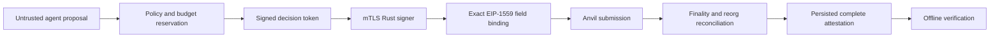

# AegisLedger

AegisLedger is a local-first security reference for AI-controlled wallets. It
turns an untrusted agent request into a versioned proposal, applies a
deterministic policy, binds the resulting authorization to one exact EIP-1559
transaction, signs through an mTLS-isolated Rust service, submits to a local EVM,
reconciles finality, and emits a complete artifact that verifies offline.

The repository also includes the deterministic AgentGuard attack/evaluation
testbed for prompt injection, malicious tools, permission abuse, and MEV.

> **Release status:** production-oriented research reference, not a production
> custody service. Use only local simulated assets. Keep the repository private
> until the owner completes the patent/publication decision and an independent
> reviewer assesses the implementation.

## Proven vertical slice



The deployed reference path enforces these properties:

- The signer decodes and canonically re-encodes a type-2 transaction, derives
  its own digest, and compares chain, nonce, wallet, recipient/contract, value,
  calldata, gas, and fees with the authorization.
- Signer identity and replay state survive restarts. Unknown authorization
  fields, key-state corruption, replay, and nonce regression fail closed.
- Decisions, reservations, signed transactions, settlement observations,
  attestations, rate windows, experiment jobs, and the hash-chained audit
  journal are durable in PostgreSQL.
- A signed transaction is submitted exactly once, reconciled across finality
  and pre-finality reorg observations, and retained with the raw bytes needed
  to recompute its network hash.
- The console and API enforce OIDC roles and object ownership. Streaming request
  bodies, per-principal rates, and active experiments are bounded.

See [Security claims](docs/SECURITY_CLAIMS.md) for the evidence and limitations
of every claim.

## Quick start

Prerequisites: Docker Desktop, Python 3.11 or 3.13, `uv`, Rust 1.97.1, Foundry
1.7.1, and Node 24 when running all host-side gates.

```bash
make bootstrap
make up
```

Open `http://localhost:4173`. The API is at `http://localhost:8000`; Keycloak,
Prometheus, Grafana, Anvil, and the signer health endpoint are loopback-only.
Bootstrap generates ignored development keys, certificates, and a policy bound
to the generated signer identity. No default secret is committed.

Prove a real local signed settlement and offline attestation:

```bash
docker compose --env-file .env.local exec --no-TTY \
  api python /app/scripts/runtime_smoke.py
```

The command prints the proposal ID, signing hash, network transaction hash,
confirmations, signer identity, lifecycle state, and attestation result.

Run the language and model gates with `make verify`. Run the disposable
reviewer flow with `scripts/reproduce_release.sh`; it retains per-gate logs and
an exact-commit checksum manifest described in [the release gates](docs/RELEASE.md).

## Repository map

| Path | Purpose |
|---|---|
| `src/aegisledger/` | API, strict contracts, policy state, signer client, settlement, attestations, durable adapters |
| `signer/` | Rust mTLS isolated signer and exact transaction authorization gate |
| `contracts/` | Testnet smart account with on-chain policy controls and invariants |
| `src/agentwallet/` | Deterministic adversarial/economic research testbed |
| `web/` | OIDC-gated React console for policy, lifecycle, experiments, and evidence |
| `migrations/` | Forward PostgreSQL schema history |
| `deploy/` | Local Keycloak, telemetry, Prometheus, and Grafana configuration |
| `docs/` | Claims, threat model, operations, results, ADRs, and release gates |

## Assurance gates

- Python: Ruff, mypy, Python 3.11/3.13 tests, whole-repository coverage floor,
  Bandit, and `pip-audit`.
- Rust: format, Clippy with warnings denied, native tests, `cargo-audit`, and
  `cargo-deny` advisory/license/source policy.
- Solidity: format, size build, unit/fuzz/invariant tests, formal model, and
  Slither medium/high gate.
- Web: TypeScript, component tests, production build, Playwright, responsive
  checks, and Axe accessibility assertions.
- Supply chain: CodeQL for Python and TypeScript, full-history secret scanning,
  digest-pinned third-party runtime images, Trivy image scans, CycloneDX SBOMs,
  and BuildKit provenance attestations.
- Runtime: clean Compose readiness plus actual proposal → signer → Anvil →
  finality → offline-attestation execution.

## Boundaries

AegisLedger does **not** claim hardware-backed key custody, a production
Keycloak/PostgreSQL topology, live-chain economic safety, formal correctness of
all implementation code, completed independent audit, or legal clearance to
publish. The local signer evidence uses a software build measurement; a real
deployment must substitute managed HSM/TEE/MPC custody and its attestation root.

Start with [Security](docs/SECURITY.md), [Operations](docs/OPERATIONS.md),
[Reviewer checklist](docs/REVIEWER_CHECKLIST.md), and
[Release gates](docs/RELEASE.md).
